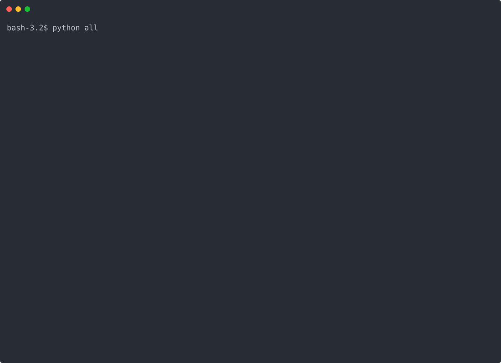

# Allociné

[](https://pypi.org/project/allocine/)
[](https://hub.docker.com/r/thibdct/seances/)


## Description

**Avec cet outil, vous récupérez les horaires des séances ciné directement dans le terminal**.

## Requirements

- Python 3.10 and above
- pip

## Installation

```bash
python -m pip install -U allocine
```

> You can also use it with Docker. Have a look at [this section](#docker)

## CLI tool usage

You just need to look for your theater identifier on [allocine.fr](allocine.fr).

Just search for your theater, and take note of the identifier in the URL. Here, it is `P0645`.




#### Help

```bash
seances.py --help
Usage: seances.py [OPTIONS] ID_CINEMA

  Les séances de votre cinéma dans le terminal, avec ID_CINEMA : identifiant
  du cinéma sur Allociné, ex: C0159 pour l’UGC Ciné Cité Les Halles. Se
  trouve dans l’url :
  http://allocine.fr/seance/salle_gen_csalle=<ID_CINEMA>.html

Options:
  -j, --jour TEXT    jour des séances souhaitées (au format DD/MM/YYYY ou +1
                     pour demain), par défaut : aujourd’hui
  -s, --semaine      affiche les séance pour les 7 prochains jours
  -e, --entrelignes  ajoute une ligne entre chaque film pour améliorer la
                     lisibilité
  --help             Show this message and exit.
```

#### Basic usage

```bash
seances.py P2235

27/12/2018
┌──────────────────────────────────────────────────────────┬──────┬───────┬───────┬───────┬───────┐
│ Astérix - Le Secret de la Potion Magique... (VF) - 01h25 │ 4.1* │ 10:15 │       │       │       │
│ L’Empereur de Paris (VF) - 01h50                         │ 3.4* │       │       │ 17:15 │       │
│ Ma mère est folle (VF) - 01h35                           │ 3.0* │       │ 14:15 │       │       │
│ Marche ou crève (VF) - 01h25                             │ 3.6* │       │       │       │ 20:15 │
└──────────────────────────────────────────────────────────┴──────┴───────┴───────┴───────┴───────┘
```

#### For tomorrow, with interlines

```bash
seances.py P2235 -j+1 --entrelignes

28/12/2018
┌────────────────────────────────────────────────────┬──────┬───────┬───────┬───────┐
│ Casse-noisette et les quatre royaumes (VF) - 01h39 │ 3.1* │       │       │ 20:15 │
├────────────────────────────────────────────────────┼──────┼───────┼───────┼───────┤
│ Ma mère est folle (VF) - 01h35                     │ 3.0* │       │ 17:15 │       │
├────────────────────────────────────────────────────┼──────┼───────┼───────┼───────┤
│ Marche ou crève (VF) - 01h25                       │ 3.6* │ 14:15 │       │       │
└────────────────────────────────────────────────────┴──────┴───────┴───────┴───────┘
```

#### For a specific date

```bash
seances.py P2235 --jour 29/12/2018
```

#### For the full week

```bash
seances.py P2235 --semaine
```

## Package usage

```python
# -*- coding: utf-8 -*-
from allocine import Allocine

allocine = Allocine()
theater = allocine.get_theater("P2235")

for showtime in theater.showtimes:
    print(showtime)
```

Example output :

```bash
27/12/2018 10:15 : Astérix - Le Secret de la Potion Magique [244560] (VF) (01h25)
27/12/2018 14:15 : Ma mère est folle [260370] (VF) (01h35)
27/12/2018 17:15 : L’Empereur de Paris [258914] (VF) (01h50)
27/12/2018 20:15 : Marche ou crève [258052] (VF) (01h25)
28/12/2018 14:15 : Marche ou crève [258052] (VF) (01h25)
28/12/2018 17:15 : Ma mère est folle [260370] (VF) (01h35)
28/12/2018 20:15 : Casse-noisette et les quatre royaumes [245656] (VF) (01h39)
29/12/2018 14:15 : Astérix - Le Secret de la Potion Magique [244560] (VF) (01h25)
[...]
```

## Development

Create a virtual environment and install the package with its development dependencies:

```bash
python -m venv .venv
.venv/bin/python -m pip install -e ".[dev]"
```

Install the pre-commit hooks once, then use `make check` to lint, format, and type-check the entire codebase:

```bash
.venv/bin/pre-commit install
make check
```

Run individual checks without modifying files:

```bash
.venv/bin/ruff check .
.venv/bin/ruff format --check .
.venv/bin/ty check
```

Run all pre-commit hooks manually with:

```bash
.venv/bin/pre-commit run --all-files
```

VS Code users should accept the workspace extension recommendations to enable live Ruff and ty diagnostics and Ruff
formatting on save.

# Docker

You can use the `seances` tool with the [Docker image](https://hub.docker.com/r/thibdct/seances/)

You may execute :

`docker run -it --rm thibdct/seances P2235`

> The Docker image is built on top of [Google Distroless image](https://github.com/GoogleContainerTools/distroless), so it is tiny :)

## 🤘 The easy way 🤘

I also built a bash wrapper to execute the Docker container easily.

Install it with :

```bash
curl -s https://raw.githubusercontent.com/tducret/allocine-python/master/seances \
> /usr/local/bin/seances && chmod +x /usr/local/bin/seances
```
*You may replace `/usr/local/bin` with another folder that is in your $PATH*

Check that it works :

*On the first execution, the script will download the Docker image, so please be patient*

```bash
seances --help
seances P2235 -j+1 --entrelignes
```

You can upgrade the app with :

```bash
seances --upgrade
```

and even uninstall with :

```bash
seances --uninstall
```
