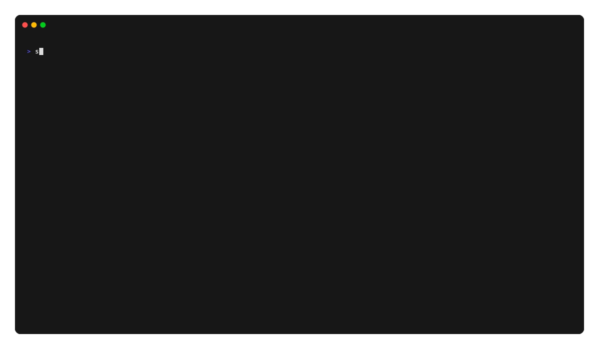

# Allociné

[](https://pypi.org/project/allocine/)


## Description

**Avec cet outil, vous récupérez les horaires des séances ciné directement dans le terminal**.

## Prérequis

- Python 3.11 ou une version ultérieure
- [uv](https://docs.astral.sh/uv/)

## Installation

```bash
uv tool install --upgrade allocine
```

## Utilisation en ligne de commande

Commencez par rechercher l’identifiant de votre cinéma sur [allocine.fr](https://www.allocine.fr/).

Recherchez votre cinéma et relevez son identifiant dans l’URL. Dans cet exemple, il s’agit de `P0645`.




#### Aide

```bash
seances --help
Usage: seances [OPTIONS] ID_CINEMA

  Les séances de votre cinéma dans le terminal, avec ID_CINEMA : identifiant
  du cinéma sur Allociné, ex: C0159 pour l’UGC Ciné Cité Les Halles. Se
  trouve dans l’url :
  http://allocine.fr/seance/salle_gen_csalle=<ID_CINEMA>.html

Options:
  -j, --jour TEXT    jour des séances souhaitées (au format DD/MM/YYYY ou +1
                     pour demain), par défaut : aujourd’hui
  -s, --semaine      affiche les séance pour les 7 prochains jours
  -e, --entrelignes  ajoute une ligne entre chaque film pour améliorer la
                     lisibilité
  --help             Show this message and exit.
```

#### Utilisation simple

```bash
seances P2235

27/12/2018
┌──────────────────────────────────────────────────────────┬──────┬───────┬───────┬───────┬───────┐
│ Astérix - Le Secret de la Potion Magique... (VF) - 01h25 │ 4.1* │ 10:15 │       │       │       │
│ L’Empereur de Paris (VF) - 01h50                         │ 3.4* │       │       │ 17:15 │       │
│ Ma mère est folle (VF) - 01h35                           │ 3.0* │       │ 14:15 │       │       │
│ Marche ou crève (VF) - 01h25                             │ 3.6* │       │       │       │ 20:15 │
└──────────────────────────────────────────────────────────┴──────┴───────┴───────┴───────┴───────┘
```

#### Pour demain, avec des interlignes

```bash
seances P2235 -j+1 --entrelignes

28/12/2018
┌────────────────────────────────────────────────────┬──────┬───────┬───────┬───────┐
│ Casse-noisette et les quatre royaumes (VF) - 01h39 │ 3.1* │       │       │ 20:15 │
├────────────────────────────────────────────────────┼──────┼───────┼───────┼───────┤
│ Ma mère est folle (VF) - 01h35                     │ 3.0* │       │ 17:15 │       │
├────────────────────────────────────────────────────┼──────┼───────┼───────┼───────┤
│ Marche ou crève (VF) - 01h25                       │ 3.6* │ 14:15 │       │       │
└────────────────────────────────────────────────────┴──────┴───────┴───────┴───────┘
```

#### Pour une date précise

```bash
seances P2235 --jour 29/12/2018
```

#### Pour toute la semaine

```bash
seances P2235 --semaine
```

## Utilisation de la bibliothèque

```python
from allocine import Allocine

with Allocine() as allocine:
    showtimes = allocine.get_showtimes("P2235")

for showtime in showtimes:
    print(showtime)
```

Exemple de sortie :

```bash
27/12/2018 10:15 : Astérix - Le Secret de la Potion Magique [244560] (VF) (01h25)
27/12/2018 14:15 : Ma mère est folle [260370] (VF) (01h35)
27/12/2018 17:15 : L’Empereur de Paris [258914] (VF) (01h50)
27/12/2018 20:15 : Marche ou crève [258052] (VF) (01h25)
28/12/2018 14:15 : Marche ou crève [258052] (VF) (01h25)
28/12/2018 17:15 : Ma mère est folle [260370] (VF) (01h35)
28/12/2018 20:15 : Casse-noisette et les quatre royaumes [245656] (VF) (01h39)
29/12/2018 14:15 : Astérix - Le Secret de la Potion Magique [244560] (VF) (01h25)
[...]
```

Le cache est activé par défaut. Les réponses sont enregistrées dans le répertoire de cache utilisateur du système :

- macOS: `~/Library/Caches/allocine`
- Linux: `${XDG_CACHE_HOME:-~/.cache}/allocine`
- Windows: `%LOCALAPPDATA%\\allocine\\Cache`

Videz le cache en ligne de commande (aucun identifiant de cinéma n’est nécessaire) :

```bash
seances --clear-cache
```

## Développement

Créez l’environnement virtuel et installez le paquet avec ses dépendances de développement :

```bash
uv sync --extra dev
```

Installez les hooks pre-commit une première fois, puis utilisez `make check` pour analyser, formater et vérifier les types
de l’ensemble du code :

```bash
uv run pre-commit install
make check
```

Exécutez chaque vérification sans modifier les fichiers :

```bash
uv run ruff check .
uv run ruff format --check .
uv run ty check
```

Exécutez manuellement tous les hooks pre-commit avec :

```bash
uv run pre-commit run --all-files
```

Les utilisateurs de VS Code doivent accepter les recommandations d’extensions de l’espace de travail afin d’activer les
diagnostics Ruff et ty en temps réel, ainsi que le formatage Ruff à l’enregistrement.

## Publication

Le workflow de publication publie sur PyPI les tags de version tels que `0.0.13` grâce à Trusted Publishing, sans
stocker de jeton d’API. Avant la première publication :

1. Créez un environnement GitHub nommé `pypi`. Il est recommandé d’exiger une approbation avant tout déploiement.
2. Dans les paramètres de publication PyPI du projet `allocine`, ajoutez un Trusted Publisher GitHub avec le
   propriétaire `tducret`, le dépôt `allocine-python`, le workflow `release.yml` et l’environnement `pypi`.

Le tag Git définit la version du paquet ; aucun fichier de version ne doit être mis à jour. Ajoutez le tag au commit à
publier. Le workflow rejette les distributions dont la version ne correspond pas au tag et effectue un test rapide du
wheel et de la distribution source avant leur publication :

```bash
VERSION=0.0.13
git tag -a ${VERSION} -m ${VERSION}
git push origin ${VERSION}
```
